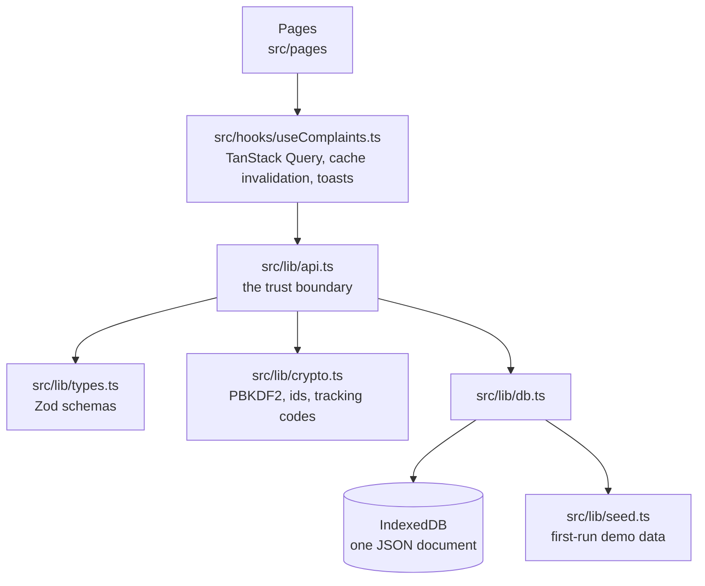

# CampusIssues - Developer Documentation

Architecture, data model, authorization rules and setup. For what the app does and who it is for, see [README.md](./README.md).

## Table of contents

- [Stack](#stack)
- [Architecture](#architecture)
- [Project structure](#project-structure)
- [Data model](#data-model)
- [The API layer](#the-api-layer)
- [Authorization rules](#authorization-rules)
- [The complaint workflow](#the-complaint-workflow)
- [SLA and statistics](#sla-and-statistics)
- [Auth and sessions](#auth-and-sessions)
- [Persistence](#persistence)
- [Theming and design tokens](#theming-and-design-tokens)
- [Seed and demo data](#seed-and-demo-data)
- [Local development](#local-development)
- [Continuous integration](#continuous-integration)
- [Security notes](#security-notes)
- [Documentation](#documentation)
- [Moving to a real backend](#moving-to-a-real-backend)
- [Gotchas](#gotchas)
- [Contributors](#contributors)
- [Glossary](#glossary)

## Stack

| Piece | Choice |
|---|---|
| Build | Vite 8, `@vitejs/plugin-react-swc` |
| UI | React 19, TypeScript 5.9 (strict), React Router 7 |
| Styling | Tailwind CSS v4 via `@tailwindcss/vite`, CSS-first config (there is no `tailwind.config.ts`) |
| Components | shadcn/ui "new-york", Radix primitives, lucide-react icons |
| Server state | TanStack Query 5 |
| Forms | react-hook-form with zod 4 resolvers |
| Charts | Recharts 3 for the time series; the ranked breakdowns are plain HTML tables |
| Toasts | sonner |

Node 20.19 or newer is required (Vite 8).

## Architecture



The important line is `api.ts`. Components never touch the database, never compute a permission and never decide whether a status change is legal. Every one of those decisions lives in one file, expressed the way a server would express it, so the port to a real backend is a rewrite of that file's internals rather than a hunt through the UI.

## Project structure

```
src/
  assets/logo-mark.png          ADK DEV mark, used for favicon, shell and README
  components/
    ui/                         shadcn primitives (18 files)
    layout/                     AppShell, PublicLayout, ThemeToggle, NotificationBell
    common/                     StatusBadge, PriorityBadge, UserAvatar, EmptyState,
                                PageHeader, Pagination, ConfirmDialog, Logo
    complaints/                 ComplaintCard, ComplaintFilters, ComplaintBrowser,
                                ComplaintForm, CommentThread, ActivityTimeline,
                                AttachmentPicker, StaffPanel, FeedbackCard
    dashboard/                  StatCard, BreakdownBars, TrendChart
    ErrorBoundary.tsx           class boundary around the whole tree
    ProtectedRoute.tsx          ProtectedRoute (user/staff/admin) and GuestRoute
  contexts/                     AuthContext, ThemeContext
  hooks/useComplaints.ts        every query and mutation the UI performs
  lib/
    types.ts                    entities, enums, label maps, zod schemas
    api.ts                      the API layer described above
    db.ts                       IndexedDB document store
    seed.ts                     demo dataset, generated relative to today
    crypto.ts                   PBKDF2 hashing, id and tracking-id generation
    format.ts                   dates, durations, file sizes, CSV, downloads
    filters.ts                  the list-filter shape and its defaults
    utils.ts                    cn()
  pages/                        one file per route
```

Route pages are lazily imported in `App.tsx` (all except the landing page), so the entry chunk stays around 118 kB gzipped and a student never downloads Recharts or the admin tables.

## Data model

Five collections in one document. Every id is prefixed (`usr_`, `cmp_`, `cmt_`, `act_`, `ntf_`) so a stray id is obvious in a debugger.

**User** - `id`, `name`, `email`, `role` (`student` | `staff` | `admin`), `department`, `identifier` (roll or employee number), `passwordHash`, `passwordSalt`, `isActive`, `createdAt`.
`PublicUser` is `User` minus the two credential fields; it is the only shape that leaves `api.ts`.

**Complaint** - `id`, `trackingId`, `title`, `description`, `category`, `priority`, `status`, `location`, `visibility` (`public` | `private`), `isAnonymous`, `authorId`, `assigneeId`, `attachments[]`, `upvotedBy[]`, `createdAt`, `updatedAt`, `dueAt`, `resolvedAt`, `closedAt`, `resolutionNote`, `satisfaction`, `reopenCount`.

**Comment** - `id`, `complaintId`, `authorId`, `body`, `isInternal`, `createdAt`.

**Activity** - `id`, `complaintId`, `actorId`, `type`, `from`, `to`, `note`, `isInternal`, `createdAt`. The append-only audit trail. Types: `created`, `status_changed`, `priority_changed`, `assigned`, `unassigned`, `commented`, `reopened`, `feedback`, `edited`.

**Notification** - `id`, `userId`, `complaintId`, `title`, `body`, `createdAt`, `readAt`.

Attachments are stored inline as base64 data URLs (`{ id, name, mimeType, size, dataUrl }`), capped at four files of 4 MB. That is the main reason the store is IndexedDB rather than localStorage.

`visibility` and `isAnonymous` are independent. A complaint can be public and anonymous (on the board, author hidden), private and named, or any other combination.

## The API layer

`src/lib/api.ts` exports the whole surface. Every mutating function re-reads the session and re-checks permission; nothing trusts an argument the UI passed.

| Area | Functions |
|---|---|
| Auth | `signUp`, `signIn`, `signOut`, `getSessionUser`, `updateProfile`, `changePassword` |
| Complaints | `createComplaint`, `updateComplaint`, `changeStatus`, `reopenComplaint`, `changePriority`, `assignComplaint`, `addComment`, `submitFeedback`, `toggleUpvote`, `deleteComplaint` |
| Reads | `listComplaints`, `getComplaint`, `trackComplaint` |
| Stats | `getStats`, `getStaffWorkload` |
| People | `listUsers`, `listAssignees`, `setUserRole`, `setUserActive` |
| Notifications | `listNotifications`, `markNotificationRead`, `markAllNotificationsRead` |
| Data | `exportData`, `resetDemoData` |

Failures throw `ApiError` with a code of `unauthenticated`, `forbidden`, `not_found`, `conflict` or `invalid`. `errorMessage()` in `useComplaints.ts` unwraps both `ApiError` and zod issues into a single string for a toast or an inline form error.

Every read goes through an 80 ms delay (`tick()`), which keeps the loading states honest rather than letting skeletons never render.

## Authorization rules

These are enforced in `api.ts`, not in the UI. The UI hides what you cannot do; the API refuses it.

**Visibility of a complaint** (`canView`): staff and admins see everything. A student sees their own complaints, plus any complaint whose `visibility` is `public`.

**Author identity** (`visibleAuthor`): if `isAnonymous` is set, the author is returned as `null` to everyone except the author themselves and staff. Staff keep the identity deliberately, because a complaint they cannot follow up on is not actionable. The detail page tells the staff member that the author is anonymous to students.

**Internal notes**: comments and activity rows with `isInternal` are filtered out of `getComplaint`, out of `commentCount`, and out of `trackComplaint` for anyone who is not staff. Only staff can create one.

**Editing**: only the author, and only while status is still `submitted`. After that the API returns a `conflict` telling them to comment instead.

**Upvotes**: any student who can view a complaint, except its author.

**Feedback**: only the author, only on a `resolved` or `closed` complaint, and only once.

**Reopen**: the author within 14 days of closure (`REOPEN_WINDOW_DAYS`), or staff at any time. Both need a reason of at least 10 characters.

**Assignment**: staff only, and only to an account that is staff or admin and active.

**People management**: admin only. Two invariants are enforced: you cannot demote or deactivate yourself, and the last active administrator cannot be demoted or deactivated. Losing staff status or being deactivated releases every complaint assigned to that person back to the unassigned queue.

**Delete**: admin only, and it cascades to comments, activity and notifications.

**Public tracking**: `trackComplaint` takes a tracking ID and returns a `TrackedComplaint` - status, category, priority, department, dates, the resolution note and a status timeline. No ids, no names, no internal notes, no attachments.

## The complaint workflow

Six statuses: `submitted`, `under_review`, `in_progress`, `resolved`, `rejected`, `closed`. The legal moves live in one table, `ALLOWED_TRANSITIONS`:

```
submitted     → under_review, in_progress, rejected, closed
under_review  → in_progress, resolved, rejected, closed
in_progress   → under_review, resolved, rejected, closed
resolved      → closed, in_progress
rejected      → under_review
closed        → under_review
```

The staff panel renders its buttons directly from that table, so the UI cannot offer a move the API would reject.

Additional rules in `changeStatus`:

- A student may only move their own complaint to `closed` (withdrawing it). Everything else is staff-only.
- `resolved` and `rejected` require a note. The staff panel opens a dialog for those two and refuses an empty box.
- Moving to `resolved` stamps `resolvedAt`. Moving to `closed` stamps `closedAt`. Moving *back* into any open state clears both, so a complaint that is being worked on again never counts toward resolution time or SLA compliance.
- `assignComplaint` promotes `submitted` to `under_review` as a side effect, and logs both events.
- `reopenComplaint` sets `under_review`, clears the completion stamps, increments `reopenCount` and sets a fresh `dueAt` from now.

Every one of these writes an `Activity` row and bumps `updatedAt`, and notifies the author, the assignee and everyone who has commented publicly, minus whoever performed the action.

## SLA and statistics

`SLA_HOURS` in `types.ts` is the single source of the response targets: urgent 24, high 72, medium 168, low 336.

`dueAt` is computed as `createdAt + SLA_HOURS[priority]`. Changing priority recomputes it **from `createdAt`**, not from now, so escalating a complaint tightens its deadline instead of extending it. A reopen is the one case that restarts the clock from the present, because the work genuinely starts again.

A complaint is overdue when it is in an open status and `dueAt` is in the past. Terminal complaints are never overdue.

`getStats` returns totals, per-status, per-category and per-priority counts, overdue and unassigned counts, mean resolution hours, SLA compliance (share of resolved complaints whose `resolvedAt` was at or before `dueAt`) and mean satisfaction. The 30-day trend is bucketed by local calendar day, so a late-night submission stays on the day it was made.

Scope: staff get the whole dataset, a student always gets only their own complaints regardless of the scope argument.

## Auth and sessions

No third-party auth. Passwords are hashed with PBKDF2-SHA256, 120k iterations, a per-user 16-byte random salt, via Web Crypto (`src/lib/crypto.ts`). Verification is a constant-time comparison.

A session is `{ token, userId, expiresAt }` in `localStorage` under `campusissues.session`, with a 7-day TTL. `AuthContext` resolves it once at boot and holds the `PublicUser`; `ProtectedRoute` waits on that resolution before deciding anything, so a reload never bounces a signed-in user to the login page.

Sign-in returns the same "Email or password is incorrect" message whether the account is missing or the password is wrong, so the form cannot be used to enumerate accounts. A deactivated account gets a distinct message, since at that point the credentials were already correct.

**Be clear about what this is.** Because the app currently persists to the browser, the hash sits on the same device as the data. It protects stored passwords from casual inspection; it is not a defence against someone with the device. The algorithm and the call sites are the ones a server would use, so moving the comparison server-side changes where `verifyPassword` runs and nothing else.

## Persistence

`src/lib/db.ts` keeps the entire dataset as one JSON document in IndexedDB (database `campusissues`, store `state`, key `database`, schema version 1).

- Read once at boot into an in-memory cache, which is why `api.ts` can be written against a synchronous object.
- `mutate(fn)` applies a change and schedules a debounced (50 ms) write, so a mutation touching three collections costs one write.
- `flush()` awaits pending writes. `exportData` calls it first.
- If IndexedDB is unavailable (private mode, blocked storage), the failure is caught, logged and the app runs from memory for that session instead of breaking.
- On first run, or on a schema-version mismatch, `seedDatabase` fills the store with the demo dataset.

The seed is generated relative to `Date.now()`, so dashboards, overdue flags and the 30-day chart always look current rather than frozen at a fixed date.

## Theming and design tokens

Tailwind v4 with no config file. Everything is declared in `src/index.css`:

- `:root` holds the light palette in oklch, `.dark` overrides it, and `@theme inline` maps the custom properties onto Tailwind's colour namespace.
- The palette is built around the ADK DEV mark (`#47266b`, about `oklch(0.35 0.12 302)`).
- Status and priority each get their own reserved token set (`--status-*`, `--priority-*`), consumed by both the badges and the charts, so a status can never be one colour in a badge and another in a chart.
- The two chart series (`--chart-created`, `--chart-resolved`) are separately chosen for light and dark, not flipped, and both pairs are validated for colourblind separation and contrast against their own surface.
- `.logo-mono` applies `brightness(0)` in light and `brightness(0) invert(1)` in dark, so the single purple PNG reads in both themes without shipping a second file.
- A blocking script in `index.html` reads `campusissues.theme` from localStorage and sets the `dark` class before first paint, so there is no flash of the wrong theme.

## Local development

```sh
npm install
npm run dev        # vite dev server on :8080
npm run build      # tsc -b && vite build
npm run preview    # serve dist/
npm run lint       # eslint, currently clean
npm run typecheck  # tsc -b --noEmit
```

There are no environment variables. There is no backend to run.

Deploying is a static build: `npm run build` and serve `dist/`. The app uses history routing, so the host must rewrite unknown paths to `index.html`.

## Seed and demo data

The database seeds itself the first time the app runs, so a fresh clone opens on a system
that already looks used rather than an empty shell. There is no setup step and no server.

| Entity | What the seed creates |
|---|---|
| Users | An admin, several staff across departments, and students |
| Complaints | A spread across every category, priority and status, with realistic ages so SLA figures and the trend chart have shape |
| Comments and activity | Threads and a full activity timeline per complaint |
| Notifications | Unread items, so the bell has a count |

| Role | Email | Password |
|---|---|---|
| Admin | `admin@campus.edu` | `Admin@1234` |
| Staff | `maintenance@campus.edu` | `Staff@1234` |
| Student | `student@campus.edu` | `Student@1234` |

The addresses are institutional-looking rather than `example.com` because the app is a
campus complaints system and the domain is part of what makes the demo legible. Nothing
here is a real inbox, no mail is ever sent, and the data never leaves the browser.

**Reset:** Settings has a reset action that wipes IndexedDB and re-seeds. Clearing site
data does the same thing.

## Continuous integration

`.github/workflows/ci.yml`, on push and PR to `main`/`master`.

| Job | Runs |
|---|---|
| **build** | `npm ci`, `npm run lint`, `tsc -b --noEmit`, `npm run build` |
| **audit** | `npm audit --omit=dev`, advisory only, but fails on any **critical** advisory |

There is no test suite to run. That is the largest gap in this repo and is recorded under
[Gotchas](#gotchas); the typecheck and build are what stand in for it today.

## Security notes

### The honest threat model

Everything runs in the browser. There is no server, so there is no place to put a check a
determined visitor cannot reach. `api.ts` enforces authorization the way a server would,
which is worth doing, but anyone with devtools can edit IndexedDB directly.

| Concern | How it is handled | What it is actually worth |
|---|---|---|
| Password storage | PBKDF2-SHA256, 120,000 iterations, per-user random salt | Protects stored passwords from casual inspection. Not from someone with device access |
| Password comparison | `constantTimeEqual`, length-independent | Hygiene. There is no remote attacker to time |
| Authorization | `requireUser`, `requireStaff`, `requireAdmin` on every mutation, plus per-record ownership checks | Correct, and the reason the port to a real backend is confined to one file |
| Input validation | Zod schemas parsed at the API boundary | Correct, and reused unchanged on a server |
| Session | Random 24-byte token, 7 day TTL | A token nobody can steal remotely, because it never leaves the machine |
| XSS | No `dangerouslySetInnerHTML` anywhere; all content renders as text | Genuinely protective |

**Do not put anything confidential in this app as it stands.** That is not a bug to fix;
it is what a browser-only application is. The design decision that matters is that every
rule lives in `api.ts` expressed server-side, so making it real is a change of storage
rather than a rewrite of the rules.

### Dependencies

`npm audit --omit=dev` reports zero advisories at any severity.

## Documentation

`README.md` and `README-light.md` are the same page in two themes. GitHub has no theme
toggle, so the toggle is a pair of files linking to each other, each using one screenshot
set. Only `README.md` is edited by hand:

```bash
npm run docs:readme-light   # regenerates README-light.md from README.md
```

The script fails loudly if a marker it rewrites has gone missing, so the two cannot
silently drift.

## Moving to a real backend

The port is deliberately contained:

1. Keep `src/lib/types.ts` as the shared contract. The zod schemas are already the request validators.
2. Replace the body of each function in `src/lib/api.ts` with a `fetch` call. Signatures, return shapes and `ApiError` codes stay as they are, so no hook and no page changes.
3. Re-implement the same checks server-side. `canView`, `visibleAuthor`, `ALLOWED_TRANSITIONS` and the note-required rule are written to be moved as-is.
4. Swap the session for whatever the backend issues, inside `readSession`/`writeSession` and `AuthContext`.
5. Move attachments to object storage and store a key instead of a data URL. `Attachment.dataUrl` becomes a URL; `AttachmentPicker` and `AttachmentList` already treat it as an opaque `src`/`href`.
6. Delete `db.ts` and `seed.ts`.

## Gotchas

- **`api.ts` mutates cached objects in place.** `mutate(fn)` hands you the live document. That is fine because every read returns a fresh projection (`toView`, `getComplaint`) and TanStack Query re-runs the query after invalidation, but do not hold a reference to a `Complaint` across a mutation and expect it to be a snapshot.
- **`listComplaints` scope `all` means something different per role.** For staff it is the whole queue. For a student it is their own complaints plus public ones - which is why the student list screen passes `mine` explicitly and the board passes `public`.
- **`commentCount` is role-dependent.** The same complaint shows a different count to a student and to staff, because internal notes are filtered out. That is intended, not a caching bug.
- **Radix Select swallows the click right after it closes.** Selecting a category and immediately clicking the next field can drop that click. It is upstream behaviour and only shows up under automation, but it is worth knowing when writing UI tests.
- **The seed is time-relative.** Snapshot tests against seeded data will drift. Assert on shape and ordering, not on dates.
- **`noUnusedLocals` and `noUnusedParameters` are on**, along with `erasableSyntaxOnly`. No parameter properties and no enums; the codebase uses `as const` arrays with derived union types instead, which is also what gives the label maps their exhaustiveness.

## Contributors

| Person | Owns |
|---|---|
| [Dileep Adari](https://github.com/Dileepadari) | Everything: the API layer, the workflow rules, the UI and the seed |

## Glossary

| Term | Meaning |
|---|---|
| **Complaint** | One reported issue, with a category, priority, status and assignee |
| **Tracking id** | The public code (`CI-7KDQ-2M4X`) that lets someone follow a complaint without an account |
| **SLA** | The hours a complaint of a given priority is allowed before it is late |
| **Activity** | An append-only entry recording every status change, assignment and comment |
| **Reopen window** | 14 days after resolution, during which the author may reopen |
| **Staff** | A user who can be assigned complaints in their department |
| **Admin** | A user who can do anything staff can, plus manage people and see every department |

---

Minor and local implementation notes that do not belong in this document are kept in
[not_for_you.md](./not_for_you.md).
