<!-- Generated from README.md by scripts/build-light-readme.mjs. Do not edit by hand. -->

<div align="center">

<picture>
  <source media="(prefers-color-scheme: dark)" srcset="./docs/assets/adk_dev_logo_light.png">
  
</picture>

# CampusIssues

**A campus complaint and feedback portal: students raise what is broken, staff get the queue, the deadlines and the record they need to fix it.**


<br>


<br><br>

**[Developer documentation](./DEVDOC.md)** · [Features](#features) · [Getting started](#getting-started)

<p><b>Light mode</b> · <a href="./README.md">View this page in dark mode</a></p>

</div>

---

## Contents

- [Why this project matters](#why-this-project-matters)
- [Where it came from](#where-it-came-from)
- [Screenshots](#screenshots)
- [Responsive layout](#responsive-layout)
- [Roles](#roles)
- [A typical complaint](#a-typical-complaint)
- [Features](#features)
- [Getting started](#getting-started)
- [Contributors](#contributors)
- [Contributing](#contributing)
- [License](#license)

---

## Why this project matters

Most campus complaint systems are a form that sends an email, and an email has no state. Nobody can tell you whether anyone read it, who owns it now, or whether the thing you reported three weeks ago is still someone's problem. So people stop reporting, and the college concludes there were no problems.

What turns a form into a system is the boring middle: a deadline that is set when the complaint is filed rather than when someone gets round to it, a routing rule that puts a broken lab machine in front of IT rather than in a shared inbox, a status that only moves through transitions that make sense, and a record that survives the person who handled it leaving.

CampusIssues is built around that middle. Raising a complaint takes a minute and gives you a tracking code you can check without an account. Everything after that is designed so a queue cannot quietly rot: response targets by priority, overdue flagged wherever a complaint appears, unassigned counted on the dashboard, and a written outcome required before anything can be closed.

## Where it came from

Two details drove the design, and both come from watching complaint systems fail rather than from a spec.

**Anonymity and followability are usually opposites.** If you let someone report a problem without their name attached, they normally lose the ability to follow it. So the honest complaints, the ones about a person or a department, get filed with a name or not at all. CampusIssues splits it: every submission returns a tracking code that works with no account, so anonymous and followable are independent. Anonymous hides your name from other students but not from the staff who may need to follow up, which is the only version of anonymity that still lets a problem get fixed.

**A deadline that starts when work starts is not a deadline.** Response targets are computed from the submission time, and changing priority re-derives them from that same submission time. Raising a complaint from medium to urgent pulls the deadline in; it never grants extra time. Without that rule, priority becomes a way to reset the clock.

## Screenshots

Every image is a real 1440x900 viewport render against the seeded demo data. This page shows **light mode**; the same gallery in dark mode is at **[README.md](./README.md)**.

<table>
  <tr>
    <td width="33%" valign="top">
      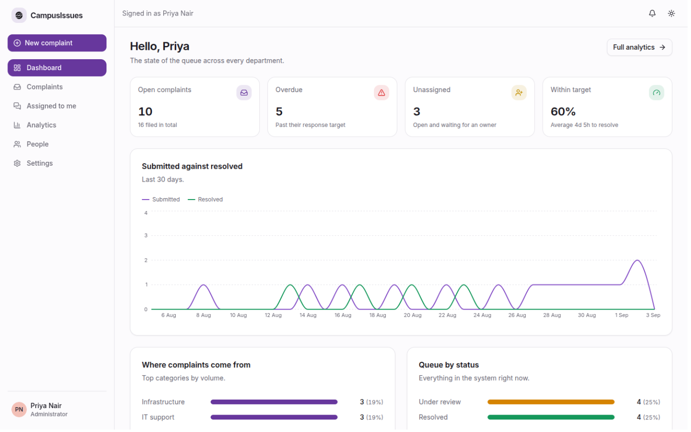
      <p align="center"><b>Dashboard</b><br><sub>Open, overdue, unassigned, and whether the queue is clearing.</sub></p>
    </td>
    <td width="33%" valign="top">
      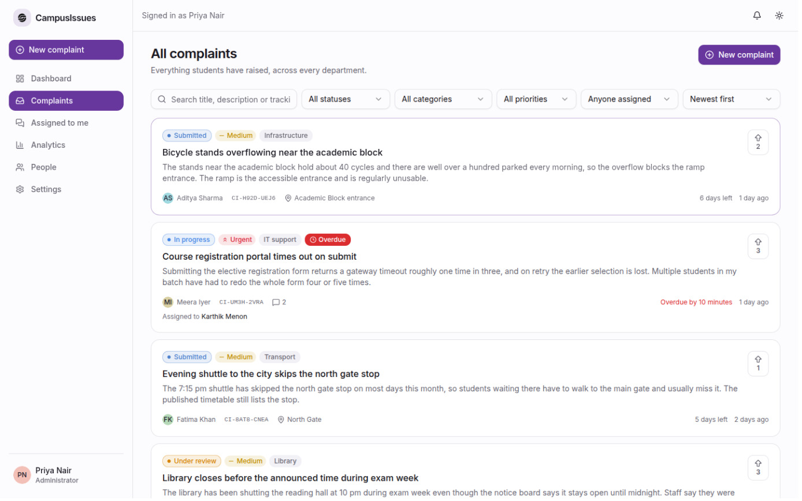
      <p align="center"><b>The queue</b><br><sub>Search, filter and sort, with overdue flagged in place.</sub></p>
    </td>
    <td width="33%" valign="top">
      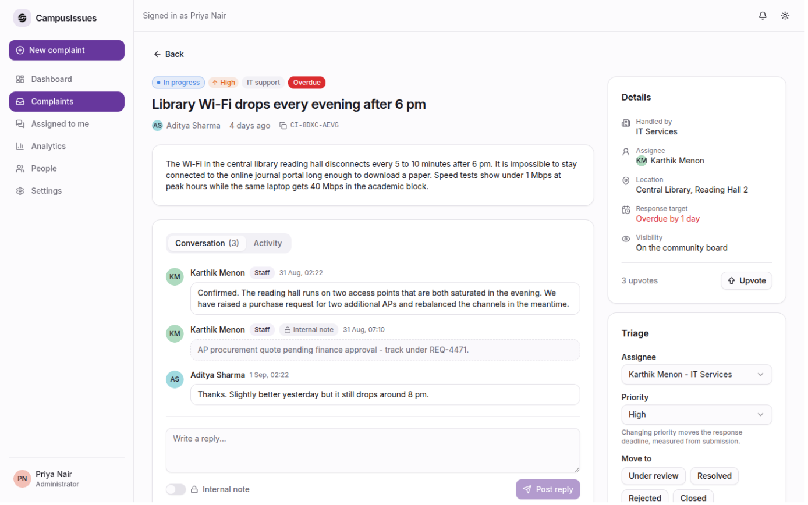
      <p align="center"><b>Complaint</b><br><sub>Conversation, internal notes, and the triage panel beside it.</sub></p>
    </td>
  </tr>
  <tr>
    <td width="33%" valign="top">
      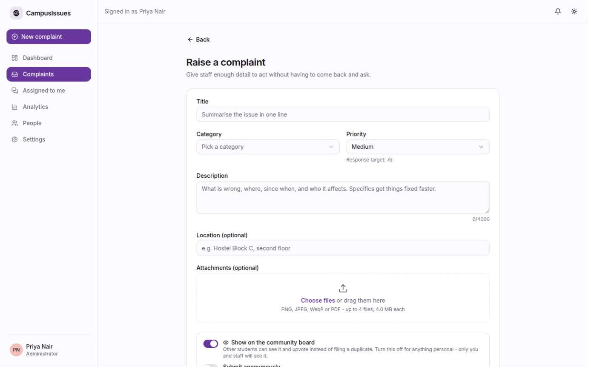
      <p align="center"><b>Raise one</b><br><sub>Category drives routing, priority drives the deadline.</sub></p>
    </td>
    <td width="33%" valign="top">
      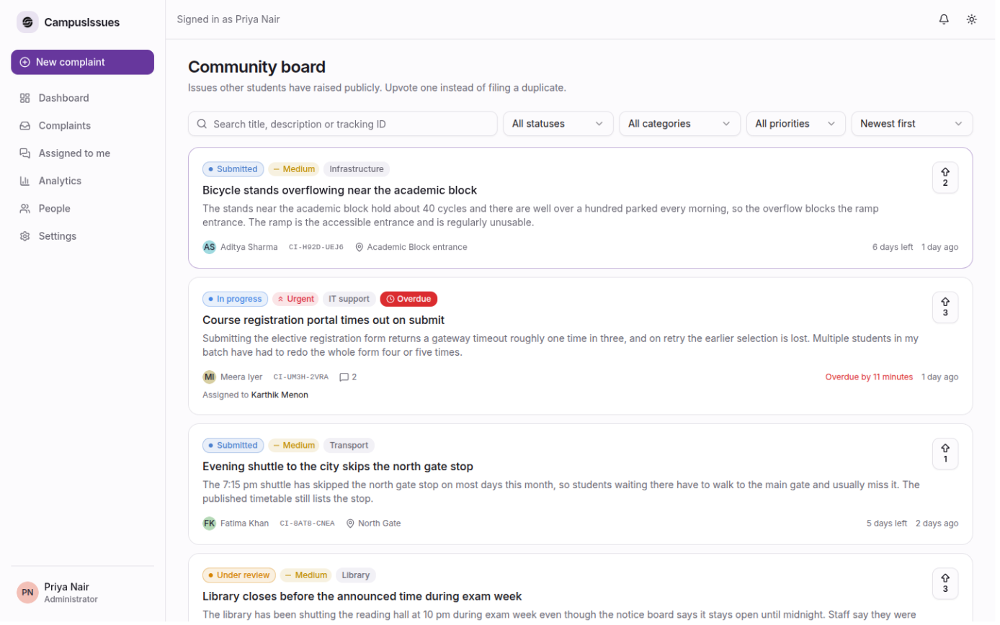
      <p align="center"><b>Community board</b><br><sub>Upvote an existing issue instead of filing a duplicate.</sub></p>
    </td>
    <td width="33%" valign="top">
      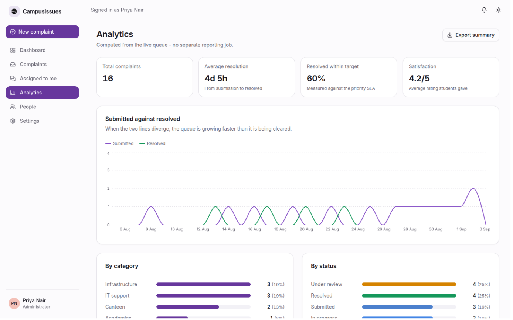
      <p align="center"><b>Analytics</b><br><sub>Resolution time, target attainment and where volume comes from.</sub></p>
    </td>
  </tr>
  <tr>
    <td width="33%" valign="top">
      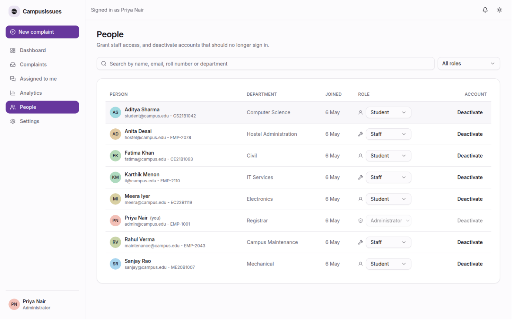
      <p align="center"><b>People</b><br><sub>Grant staff access and deactivate accounts.</sub></p>
    </td>
    <td width="33%" valign="top">
      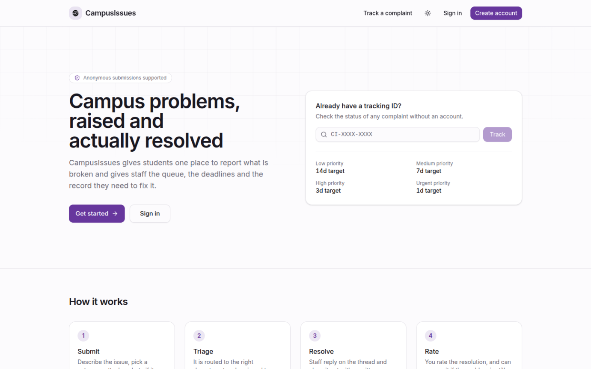
      <p align="center"><b>Public landing</b><br><sub>Track any complaint by code, with no account.</sub></p>
    </td>
    <td width="33%" valign="top">
    </td>
  </tr>
</table>

## Responsive layout

Each image is its own device viewport. The sidebar collapses to a menu and the stat tiles stack.

<table>
  <tr>
    <td width="22%" valign="top">
      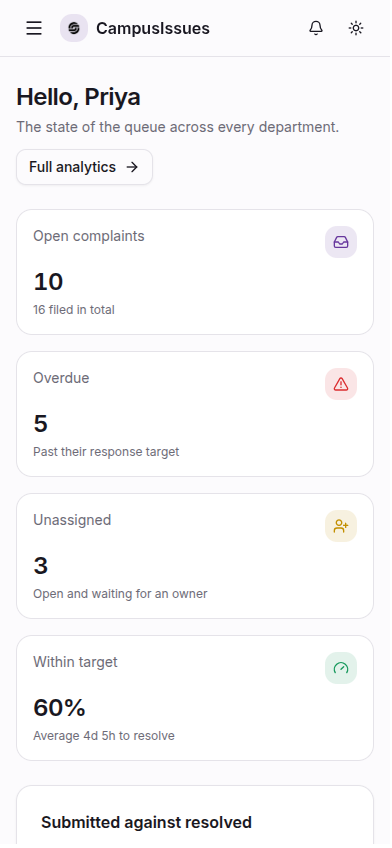
      <p align="center"><sub><b>Dashboard</b><br>390 x 844</sub></p>
    </td>
    <td width="22%" valign="top">
      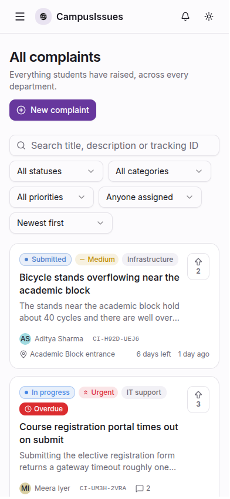
      <p align="center"><sub><b>Queue</b><br>390 x 844</sub></p>
    </td>
    <td width="46%" valign="top">
      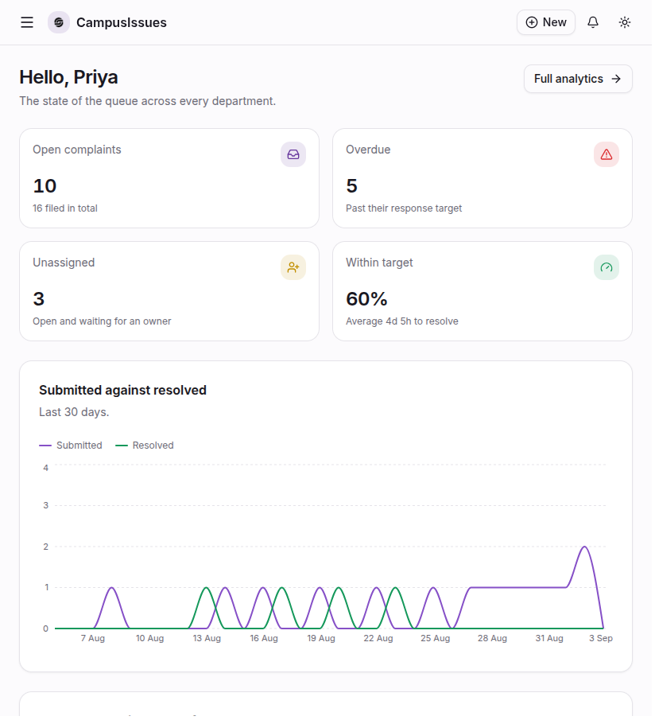
      <p align="center"><sub><b>Dashboard</b><br>820 x 900</sub></p>
    </td>
  </tr>
</table>

## Roles

| Role | What they can do |
|---|---|
| Student | Raise complaints, follow their own, reply on the thread, upvote public ones, rate a resolution, reopen it if the problem is still there |
| Staff | Everything a student can do, plus triage: assign, set priority, move status, leave internal notes, see the analytics |
| Administrator | Everything staff can do, plus manage people (grant staff access, deactivate accounts) and delete a complaint outright |

Self-service sign-up always creates a student account. Staff and administrator access is granted by an existing administrator from the People screen.

## A typical complaint

1. **Submit.** Title, category, priority, description, optional location and up to four attachments. You choose whether it appears on the community board and whether your name is attached.
2. **Get a tracking ID.** Something like `CI-7KDQ-2M4X`. Anyone holding it can check progress from `/track` with no account, which is what makes anonymous submissions still followable.
3. **Triage.** The complaint is routed to a department by category, an administrator or staff member assigns it, and the status moves to under review.
4. **Work.** Staff reply on the thread. Internal notes are visible to staff only, and never appear in the student's view, the activity timeline or public tracking.
5. **Close.** Resolving or rejecting requires a written outcome. The student sees exactly that text.
6. **Rate or reopen.** The person who raised it rates the resolution out of 5. If the problem is still there they can reopen within 14 days, which puts it back under review with a fresh deadline.

## Features

### Raising and tracking
- Twelve categories, each routed to a named department (IT Services, Hostel Administration, Campus Security, and so on)
- Four priorities, each with its own response target: urgent 24h, high 3d, medium 7d, low 14d. The deadline is set at submission and shown on every card
- Attachments: PNG, JPEG, WebP or PDF, up to four files of 4 MB each
- Two independent privacy switches. **Anonymous** hides your name from other students but not from the staff handling it, because they may need to follow up. **Private** keeps the complaint off the community board entirely
- Edit a complaint until staff start work on it. After that, add a comment instead
- Withdraw your own complaint at any time while it is open

### Community board
- Complaints published to the board are visible to every signed-in student
- Upvote one instead of filing a duplicate, so a shared problem carries weight
- You cannot upvote your own complaint

### For staff
- The full queue with search across title, description, tracking ID and location, plus filters on status, category, priority and assignee, and six sort orders including "due soonest"
- Assignment to any active staff member. Picking up an untriaged complaint moves it to under review automatically
- Changing priority re-derives the deadline from the submission time, so raising priority pulls the deadline in rather than granting extra time
- Internal notes on the thread, marked as such and hidden from the student
- Status changes follow a fixed workflow. Only the transitions that make sense from the current state are offered
- Overdue complaints are flagged everywhere they appear

### Dashboards and analytics
- Students see what they filed, what is still open, what was resolved and the average rating they gave
- Staff see open volume, overdue count, unassigned count and the share of complaints resolved within target
- A 30-day chart of submitted against resolved: when the lines diverge, the queue is growing faster than it is being cleared
- Breakdowns by category, status and priority, plus a per-staff workload table with average resolution time
- Summary export as CSV

### Everything else
- Notifications for assignment, replies, status changes and reopens, with an unread count in the header
- Light, dark and system themes, applied before first paint so there is no flash
- Full data export as JSON. Students get their own complaints, staff get the whole record
- Public tracking page that returns status and progress but never an identity or an internal note

## Getting started

No backend, no database to install, no environment file. The app seeds itself on first run.

```bash
git clone https://github.com/Dileepadari/CampusIssues.git
cd CampusIssues
npm install
npm run dev          # http://localhost:5173
```

### Demo accounts

The seed creates an admin, staff across several departments, students, and sixteen complaints spread across every category, priority and status so the queue and the analytics both have something to show. The login screen lists these and fills the form when you click one.

| Role | Email | Password |
|---|---|---|
| Administrator | `admin@campus.edu` | `Admin@1234` |
| Staff | `maintenance@campus.edu` | `Staff@1234` |
| Student | `student@campus.edu` | `Student@1234` |

Nothing leaves your browser. **Settings** has a reset that wipes the local database and re-seeds it.

### Checks

```bash
npm run lint
npx tsc -b --noEmit
npm run build
```

## Contributors

<table>
  <tr>
    <td align="center" width="150">
      <a href="https://github.com/Dileepadari">
        
        <br>
        <sub><b>Dileep Adari</b></sub>
      </a>
      <br>
      <sub>Author and maintainer</sub>
    </td>
  </tr>
</table>

## Contributing

Issues and pull requests are welcome on [the repository](https://github.com/Dileepadari/CampusIssues).

Before opening a PR, run what CI runs:

```bash
npm run lint
npx tsc -b --noEmit
npm run build
```

Conventions: single-line commit messages, no em dashes and no literal emoji anywhere, and update `DEVDOC.md` in the same change if you add a status, a category or a rule.

One rule worth knowing before touching the logic: **every workflow and authorization decision lives in `src/lib/api.ts`**, written the way a server would express it, and components never compute a permission or decide whether a status change is legal. That is what keeps the port to a real backend a rewrite of one file rather than a hunt through the UI.

## License

[MIT](./LICENSE) © Dileep Adari
